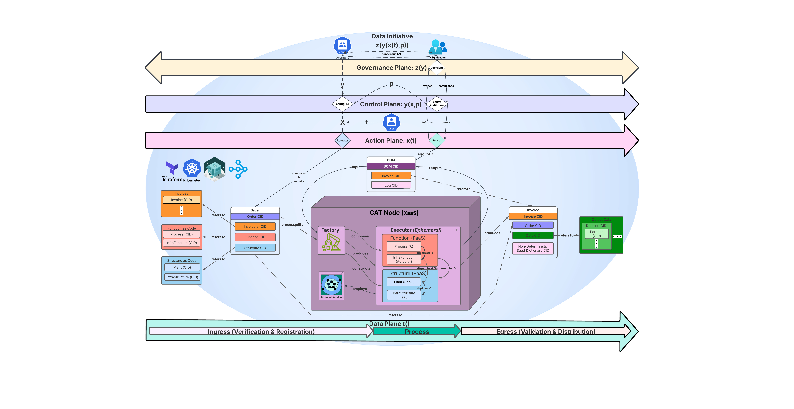
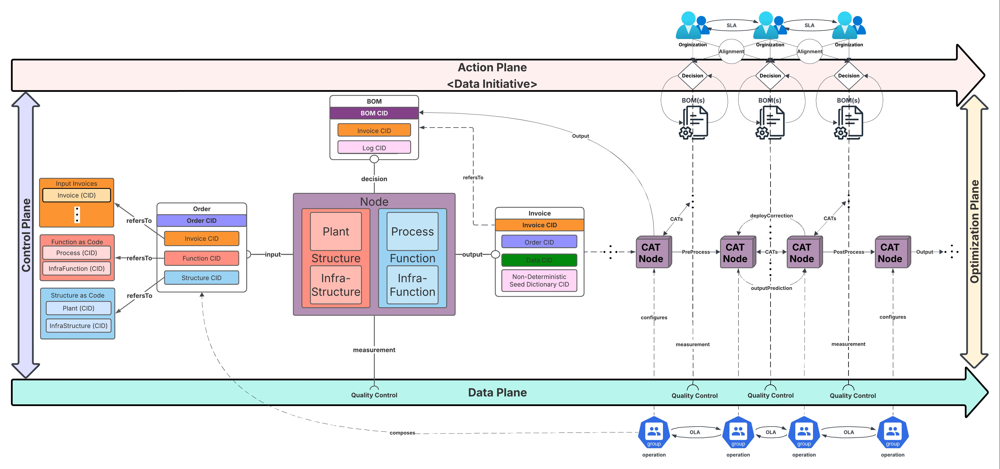

# CATs: Content-Addressable Transformers

## Description:

**Content-Addressable Transformers (CATs)** is an edge-computing [XaaS](https://www.ibm.com/think/topics/xaas) framework that establishs a **[Data Mesh](https://www.datamesh-architecture.com/#what-is-data-mesh)** as a *self-service* Platform for *intra/inter-orginizational Data Service Collaboration* with *verifiable* **Data Provenance**. **CAT Nodes** are edge/mesh-peer implimentations of **[Data Products](https://www.datamesh-architecture.com/#data-product)** intended to be system *integration points* that enable collaboration on the *verification, retrieval, and re-execution* of **interoperable** and scalable computing / data processing workloads and their components *intra/inter-orginizationally* via *content-addressing* their **[Bills-Of-Materials (BOMs)](https://en.wikipedia.org/wiki/Bill_of_materials)** as a means of Data Provenance. CAT Node's output BOMs to provide access to a domain's analytical data as a product and to **verify** the means of processing as code (input, transformation / process, output, & infrastructure) beteen CAT Nodes. BOMs are used as *supply-chains of evidence* that certify the accuracy of services offered by *Data Products* by enabling the maintenance and reporting of [data and process lineage & provenance](https://bi-insider.com/posts/data-lineage-and-data-provenance/).   

*CAT Nodes* scales compute / data processing workload portability between client-server cloud platforms and mesh (p2p) networks with minimal rework or modification. *CAT Node's* enable this via their execution of horizontal, vertical, and heterogenious scallable **CATs** or *content-addressed data processing (/ transformation)* **workloads**. CATs are inputed & outputted as **BOMs** acting as *Data Provenance records* which are used to establishe a Data Mesh. The Data Mesh is established using BOMs because the edge protocol mechanism used for the [Content-Addressed Storage (CAS)](https://en.wikipedia.org/wiki/Content-addressable_storage) of CATs as BOMs is also the means of Data Transport that networks CAT Nodes as verifiable lineages of Data Provenance (* **[Details](docs/LineageOfProvenance.md)**). This enables the Mesh to grow naturally / heterogeneously scale when organizations communicate with BOMs as a means of cross-collaboration on *Data Products* within the feedback loops of their **Data Initiatives.**

CAT Nodes are **Data Products** - peer-nodes on a mesh network that encapsulate components (*) to function as a service providing access to a domain's analytical data as a product; * code, data & metadata, and infrastructure.

## Computational Governance:

###  The *Control-Feedback Loop* of CAT Nodes' *Architectural Quantum*:

*CAT Node's* **[Architectural Quantum (AQ)](https://martinfowler.com/articles/data-mesh-principles.html#LogicalArchitecturedataProductTheArchitecturalQuantum)** is a [*Minimal* **Federated Operating Model (FOM)**](https://www.starburst.io/blog/data-mesh-book-bulletin-principle-of-federated-computational-governance/) as the re-executable and exchangable *atomic unit* representating the architectural domain of Data Product contriburion. The AQ is content-addressed within a BOM containing the AQ's components such that organizations can collaborate on a Data Mesh with verifiable provenance of *interoperable AQ compoents*. CAT Node's runtime realization of the *minimal FOM / Quantum Architecture* is the **Ordering** of **Execution** is **Invoiced** into a **Bill-Of-Materials** as the following **Control-Feedback Loop**:
* **Detailed** *Loop* [here](./docs/ControlFeedbackLoop.md)
* **Summarized** *Loop* below:
  * **A: Manifactured Execution** - CATs (*CAT workloads*) are **Ordered** and **Invoiced** for verification and registered as **[BOMs](docs/BOM.md)** to serve as **Data Provenance records** that uniquely identify CATs and their content for **verifiable data processing** using content-addresses. CATs are deployable as parallelized and distributed processes to support scalable data processing microservices.
    * **1.** the *Node's* **Factory** 
      * **a.** *consumes* & *processes* a content-addressed **Order**
      * **b.** *composes* and *produces* an *ephemeral* **Executor** of CATs using *AQ components* within **Order**
    * **2.** the *Node's* **Executor** 
      * **a.** *executes* the *AQ components* as **Function [FaaS]** on **Structure [PaaS]**
      * **b.** **Invoices** the *execution of data prcessing* as staged output **Content-Addresses**
  * **B: Content-Addressed Bills-of-Materials (BOMs)** - *BOMs* employ **Content Identifiers (CIDs)** as *Content-Addesable Storage* of CATs to provide a means of [Data Verification](https://en.wikipedia.org/wiki/Data_verification) & location-agnostic **data transportation / retrieval** via a unique identification of CAT content. CATs' use of this content-addressing mechanism establishes a self-service Data Mesh as a heterogeneously scalable Compute Platform deployable on [Kubernetes](https://kubernetes.io/) as CAT Node's execution paradigm (Structure [PaaS]). 
    * **3.** the *Node's* **Runtime** *emits* a **BOM** as the *Mesh-transportable Data Provenance record* to be *shared* & *re-executed* between Node

### The sustainment of *Data Initiatives* & *Product Collaboration* on a Data Mesh's Architectural Planes using CATs' *Architectural Quantum*:

Participating organizations and collaborators will employ CATs for rapid ratification of service agreements within collaborative feedback loops of **[Data Initiatives](https://github.com/DynamicalSystemsGroup/cats?tab=readme-ov-file#continuous-data-initiative)**. CATs' **Architectural Quantum (AQ)** is a [Minimal Federated Operating Model](https://www.starburst.io/blog/data-mesh-book-bulletin-principle-of-federated-computational-governance/) employed by CATs' **Architectural Planes** as a *Domain-Driven Design* principle described in **[Data Mesh of Data Products](https://martinfowler.com/articles/data-mesh-principles.html)** to *reify Data Initiatives* (**[Design Description](docs/DESIGN.md)**).
- CATs' **Action Plane** is the *Data Product Management interface* that orchestrates and supervises how virtual resources owned by *Data Product(s)* should be *managed, routed, and processed* in alignment with *Data Initiatives* and is stored “offmesh” (“offline”). CAT Node's realize the AQ's *Control-Feedback Loop* on the Action Plane which supervises the exchange of data between CAT sub-components on the *Data Plane* in adherence to Data Contracting Standards of **Service-Level Aggreements (SLA)** between participating organizations on the Data Mesh.
  - **Inter-Product Collaboration:** Multi-disciplinary and cross-functional *Data Stewardship teams* manange Data Products Inter-Orginizationally on the Action Plane via the registration and cataloging of **BOMs** by *Data Product teams*. The Action Plane establishes and sustains *Data Initiatives* because content-addressing BOMs for **Data Provenance** makes CATs *reteivable, shareable, composable, re-executable, and iteroperable* amongst independent teams such that they support *Intra/Inter-Orginizational Collaboration* on **Data Products**. *Data Initiatives* will be naturally established as a result of cross-collaboration on CAT Node's *Data Products* by communicating BOMs that produce CATs. 
- CATs' **Data Plane** is the *Analytical Data Processing interface* that *orders, executes, invoices, and transports* content-addressed **CATs** between CAT Nodes as mesh-shareable **BOMs** to be stored “onmesh” (“online”) in alignment with *Data Initiatives* and in adherence to Data Contracting Standards of **Operational-Level Agreements (OLA)** between participating organizations on the Data Mesh.
  - **Intra-Product Collaboration:** Multi-disciplinary and cross-functional *Data Product teams* impliment CAT Nodes to produce interconnected *Data Services of CATs between Products* on a Data Mesh by *operating, contributing, and maintaining* different portions of the entire cloud-service model (XaaS) in adherence to CATs' *Architectural Quantum*. Teams can submit contributions as CAT **Orders** based on Subject-Mater Expertise and/or their roles using CATs’ *Order API*. 
  - CAT's **Order API** is used to generate an *Order* of CATs and is a part of BOM's Data Model for which can be utilized for a variety of Use-Cases.

## Get Started!:
#### 0. Clone CATs:
```bash
git clone git@github.com:DynamicalSystemsGroup/cats.git
cd cats
uv python install   # installs the Python version pinned in .python-version
uv sync             # creates .venv and installs locked dependencies from uv.lock
```
  - See [ENV.md](./docs/ENV.md) for the full environment workflow, including the `ops` and `mac` extras.
#### 1. Installation:
`make deps-all` - Runs on macOS or Linux (see the [Makefile](./Makefile) and `make help`), or follow [DEPS.md](./docs/DEPS.md) to install each dependency manually.
#### 2. [Node Lifecycle](./docs/NodeLifeCycle.md) — start / status / stop:
```bash
make node-up     # content-store-ensure && node-start
make node-status # flask=up|down + content_store=ready|not_ready
make node-stop   # Flask only — host Kubo left running
```
*Optional:* `make node-down` = `make node-stop` + `ipfs shutdown`
Full command reference, exit codes, and why ensure ≠ start: [NodeLifeCycle.md](./docs/NodeLifeCycle.md).
#### 3. [Demonstration](./docs/DEMO.md):
CAT Node is shipped with *Techncal Use-Case CAT Workload Specifications ( Templates / "Recipies")* as *CAT **Orders*** for which proccess will be executed and **Invoiced**. This repository will feature a Scalable Scientific Computing application **Ordered** as a 2 CATs. This **Order** is specified to utilize [Ray](https://www.ray.io/) as an execution middleware framework **Plant (SaaS)** deployed on **[Kubernetes](https://kubernetes.io/)** for interoperable & parallelized distributed computing applications / Big Data processing with Scientific Computing enabled [ecosystem integrations](https://docs.ray.io/en/latest/ray-overview/ray-libraries.html) such as [Apache Spark](https://spark.apache.org/), and [PyTorch](https://pytorch.org/).
#### 4. [Testing:](./docs/TEST.md) *CAT Node Integration & Unit Tests*
#### 5. [Dashboards](./docs/DASHBOARDS.md)
#### 6. Auto-Diagramming Software Archtecture:
`make diagrams` - requires `Graphviz` for PNG output — `make deps-graphviz` (or `make deps-all`)
  * Constituent Commands / Utilities: 
    * `code2flow` used to generate *Functional Component Activity Diagram*: 
      * `uv run python utils/code2flow/diagram_c2f.py`
    * `pyreverse` used to generates *Class & Dependency Diagrams*: 
      * `uv run pyreverse -o png -p CATs -d images/pyreverse cats`

### [Contribute!](docs/CONTRIBUTING.md)

### CAT Mesh: CATs Data Mesh platform with Data Provenance

**In the following image:** 

- Large ovals in the image above represent **Data Products** servicing each other with Data
- "O" ovals are Operational Data web service endpoints
- "D" ovals are Analytical Data web service endpoints
- Source: [Data Mesh Principles and Logical Architecture](https://martinfowler.com/articles/data-mesh-principles.html) - Zhamak 
Dehghani, et al.


## Key Concepts:

- **[Data Verification](https://en.wikipedia.org/wiki/Data_verification)** - a process for which data is checked for 
accuracy and inconsistencies before processed
- **[Data Provenance](https://bi-insider.com/posts/data-lineage-and-data-provenance/)** - a means of proving data 
lineage using historical records that provide the means 
of pipeline re-execution and **[data validation](https://en.wikipedia.org/wiki/Data_validation)**
- **[Data Lineage](https://bi-insider.com/posts/data-lineage-and-data-provenance/)** - reporting of data lifecyle from 
source to destination
- **[Bill of Materials (BOM)](https://en.wikipedia.org/wiki/Bill_of_materials)** - an extensive list of raw materials,
components, and instructions required to construct, manufacture, or repair a product or service
- **[Content-Addressing](docs/CAS.md)** - reffers to **Content-Addressed Storage (CAS)**, which is a method of uniquely identifying and retrieving information based on its content rather than its location or address.
- **[Distributed Computing](https://en.wikipedia.org/wiki/Distributed_computing)** - typically the concurrent and/or 
parallel execution of job tasks distributed to networked computers processing data

### [Experiments](./experiments/EXP.md)

### Image Citations:

- **["Illustrated CAT"](https://github.com/DynamicalSystemsGroup/cats#illustrated-cat)**
  - [Python logo](https://tse4.mm.bing.net/th?id=OIP.ubux1yLT726_fVc3A7WSXgHaHa&pid=Api)
  - [SQL logo](https://cdn3.iconfinder.com/data/icons/dompicon-glyph-file-format-2/256/file-sql-format-type-128.png)
  - [Terraform logo](https://tse2.mm.bing.net/th?id=OIP.1gAEVon2RF5oko4iWCfftgHaHO&pid=Api)
  - [IPFS logo](https://tse1.mm.bing.net/th?id=OIP.BRyW5Tdm5_6VQxCsGr_sQAHaHa&pid=Api)
  - [cat image](https://tse1.mm.bing.net/th?id=OIP.xS_itpeyTImMcrcQ_YNsfQHaIu&pid=Api)
  - [ray.io logo](https://open-datastudio.io/_images/ray-logo.png)

## Acknowledgments

CATs was developed by the [Dynamical Systems Group (DSG)](https://github.com/DynamicalSystemsGroup) team.

**Key contributions:**

- **Network Architecture & Verified Information Exchange:** 
  - [Michael Zargham (mzargham)](https://github.com/mzargham) 
  - [David Sisson](https://github.com/davidfsol5)
- **Lead Solutions Architect / Distributed Systems & Software Engineer** 
  - [Joshua E. Jodesty](https://github.com/JEJodesty)
- **Testing:** Danilo