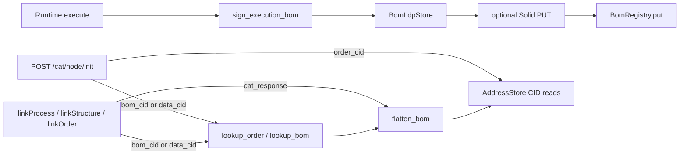

# Node-local BOM registry (`BomRegistry`)

`BomRegistry` (`cats/network/registry/`) is the Node-local **query index** of verified
[ExecutionBom](BOM.md#cat-node-http-bom-response) envelopes. It is how the
[Control-Feedback Loop](ControlFeedbackLoop.md) discovers the next **Order** from a
prior BOM (`bom_cid` → `order_cid`) and recovers *which* BOM produced a given
output (`data_cid` → `[bom_cid, …]`) without a caller-held HTTP `cat_response`.

CID **or** digest/`ni:` remains the **equality / lineage key** for Invoice / Order / stage bytes;
**new** mints also carry HTTP `*_uri` as the data-plane address of record
([AddressStore](IPFS.md) / [CAS-over-HTTP](STORAGE.md) / Phase 2b). The registry is an append-only **projection** of those
envelopes — not a second store of provenance payloads. `LocatorIndex` (`by-content/`) maps
content ids to HTTP CAS / Order / Invoice locators. Index **keys** stay hash-based (`by-data` / `by-order`), not URL-based.

| This is | This is not |
| --- | --- |
| Queryable index of verified BOMs | The envelope store ([`BomLdpStore`](SOLID.md) / Solid) |
| Written on `Runtime.execute` (fail closed) | [LDN](https://www.w3.org/TR/ldn/) Announce (push-only, best-effort) |
| Node-local under `{CATS_HOME}/.cats/registry/` | Mesh-federated / Action Plane catalog |
| GET `/ldp/registry/…` | HTTP PUT of records (405; Runtime indexes only) |

Always on (same policy as the Node LDP cache): no env gate. Index write failure
fails `Runtime.execute`. Needed even if Kubo stays forever — lineage / `init` /
`link*` still cannot find a BOM from `data_cid` alone without this index.

## Why it exists

The Control-Feedback Loop specifies that the next Order is consumed **from within
a BOM** (`invoice.order_cid`) rather than only supplied out-of-band as
`order_cid`. Lineage chains by carrying each CAT’s output `data_cid` into the
next Invoice — a BOM’s own `bom_cid` is never written into IPFS-addressed
content (it is response / LDP only).

Without a registry:

- `POST /cat/node/init` could only take a bootstrap `order_cid`.
- `linkProcess` / `linkStructure` / `linkOrder` required a prior HTTP
  `cat_response` in the caller’s process.

The registry closes those gaps **on one Node**. Remaining work is mesh
federation of the index and Solid dual-write of registry records (Phase 2b
URI + `ni:` dual-field and `content_id` → HTTP locators are landed). See [`W3C.md`](W3C.md).



## Record shape

`build_record(bom, bom_cid, *, content_mesh, locators)` **verifies** the signed
envelope (`verify_execution_bom`), then extracts Invoice / Order fields via
AddressStore. It does **not** trust client-supplied index fields beyond optional
locators. Unsigned or tampered proofs raise `RegistryError`.

```text
{
  bom_cid, invoice_cid, order_cid, data_cid,
  input_data_cid, node_did,
  function_cid, structure_cid,
  locators: { bom_ldp_uri, bom_solid_uri },
  ingress_data_cid, integration_data_cid, seed_cid
}
```

`ingress_data_cid` / `integration_data_cid` / `seed_cid` are stored on the
record but **not** reverse-indexed in this MVP. If the Order graph is only
partially available, `build_record` still indexes BOM → Order / `data_cid` and
leaves `function_cid` / `structure_cid` / `input_data_cid` unset.

## Disk layout

JSON under `{CATS_HOME}/.cats/registry/` (mirrors `BomLdpStore`; no SQLite).
Path segments are CID- or digest-safe (`content_id_fs_key`). `put` is idempotent
on `bom_cid`. Reverse-index files are append-if-absent lists, **newest first**.
CAS locators live under `by-content/` (hex digest keys).

```text
{CATS_HOME}/.cats/registry/
├── boms/<bom_cid>.json          # record (bom_cid → fields above)
├── by-data/<data_cid>.json      # [bom_cid, …]  (replay / re-execute)
├── by-order/<order_cid>.json    # [bom_cid, …]  (many BOMs per Order)
└── by-content/<digest>.json     # { content_id, locators: [{ uri, … }] }
```

Python API (`cats.network.registry.BomRegistry`):

| Method | Returns |
| --- | --- |
| `put(record)` | Writes record; appends reverse indexes if absent |
| `get(bom_cid)` | Record dict or `None` |
| `lookup_order(bom_cid)` | `order_cid` or `None` |
| `lookup_bom(data_cid)` | `[bom_cid, …]` (newest first) |
| `lookup_by_order(order_cid)` | `[bom_cid, …]` |
| `resolve_unique_bom(data_cid)` | Sole `bom_cid`, else `RegistryError` / `AmbiguousBomError` |
| `list_boms()` | `bom_cid` keys by mtime descending |

## Publish on execute

`Runtime.execute` signs the BOM, mints content id on **CAS** (`ni:`), writes
`BomLdpStore`, then (when Solid is configured) dual-writes the envelope.
**After locators are known**, it indexes:

```python
BomRegistry(self.CATS_HOME).put(build_record(
    bom, bom_cid,
    content_mesh=self.contentMesh,
    locators={'bom_ldp_uri': ..., 'bom_solid_uri': ...},
))
```

Fail closed (same policy as Solid PUT). LDN stays best-effort and is **not**
the index. Registry indexing still runs when Solid env is unset
(`bom_solid_uri` is `null`).

## Query HTTP (GET only)

Registered from [`cats/node/app.py`](../cats/node/app.py) next to LDP
(`register_registry_routes`). Writes are Runtime-only.

| Route | Response |
| --- | --- |
| `GET /ldp/registry/` | LDP Basic Container listing newest `bom_cid` URIs |
| `GET /ldp/registry/boms/<bom_cid>` | Registry record JSON; missing → 404; **PUT → 405** |
| `GET /ldp/registry/by-data/<data_cid>` | `{data_cid, bom_cids: [...]}` (newest first) |
| `GET /ldp/registry/by-order/<order_cid>` | `{order_cid, bom_cids: [...]}` |
| `GET /ldp/registry/by-content/<digest>` | `{ content_id, locators: [...] }` (CAS locator index) |

Invalid CID path segments → 400. `HEAD` / `OPTIONS` follow the LDP resource /
container header pattern used by `/ldp/boms/`.

**Not the registry:** `GET /ldp/boms/` (local envelope list), Solid GET by a
known `bom_cid`, LDN Announce. Those are locators / notifies; this is the
**queryable index**.

## `POST /cat/node/init` intake

Body may identify the Order three ways. Prefer `order_cid` when several keys
are sent so existing clients keep working.

| Body | Resolution |
| --- | --- |
| `{order_cid}` | Unchanged bootstrap / `create_order_request` path |
| `{bom_cid}` | `lookup_order` → load that Order via AddressStore → Factory |
| `{data_cid}` | `lookup_bom`; 0 hits → **404**; 1 hit → treat as `bom_cid`; several → **409** `{bom_cids}` |
| none of the above | **400** (`order_cid, bom_cid, or data_cid required`) |

`{bom_cid}` / unique `{data_cid}` execute **that** Order (consume the plan from
the indexed BOM). Forward chaining remains `link*`.

## `linkProcess` / `linkStructure` / `linkOrder`

Each helper still accepts a prior HTTP `cat_response`. When that object is
omitted, pass `bom_cid=` or `data_cid=` instead. Explicit `bom_cid` always
wins if both are set.

`OrderOps._response_from_registry` loads the registry record, then the signed
envelope from local `BomLdpStore` (fallback `fetch_bom_envelope` via
`bom_ldp_uri` / `bom_solid_uri`), and returns `{bom, bom_cid, bom_ldp_uri,
bom_solid_uri}` for the existing `flatten_bom` path. Same 404 / 409 rules as
`init` for `data_cid` (`AmbiguousBomError`).

## Ambiguous reverse lookup

Replay can mint many BOMs per Order and many BOMs per `data_cid`.
`lookup_bom` / `lookup_by_order` therefore return **lists**. Intake that must
pick a single producer (`init` / `link*` with only `data_cid`) succeeds only
when the list has exactly one entry; otherwise **409** with the candidate
`bom_cid`s. Pass `bom_cid` to disambiguate.

A “downstream” pointer (who later consumed this output) is still deferred:
no BOM can know at creation time who will consume it. That link is only
discoverable from the consuming CAT’s side, going forward — see
[`LineageOfProvenance.md`](LineageOfProvenance.md).

## Out of scope (later)

Beyond Phase 2b MVP (URI + `ni:` dual-field is landed):

- Mesh federation of the index / Action Plane catalog filters
- Solid PUT of registry records
- Mesh-federated / Solid dual-write of CAS locator maps
- Hard-drop of `*_cid` field names (URI-only graph slots)
- SPARQL over the index
- Consumer-side downstream edges
- Plant / MinIO / Ray

## Tests

```bash
uv run pytest -s tests/test_bom_registry.py
```

Covers store put/get, idempotent `bom_cid`, reverse-index append, CID path
rejection, unsigned/tampered `build_record`, Invoice `data_cid` (not a lying
hint), Flask GET / PUT 405, `init` `{bom_cid}` / `{data_cid}` / 409, and
`linkProcess(bom_cid=…)` / `linkProcess(data_cid=…)`. Runtime execute
indexing is asserted in [`tests/test_ldp_bom_control_plane.py`](../tests/test_ldp_bom_control_plane.py).
CAS put/get/verify, manifests, and locators: [`tests/test_cas_http.py`](../tests/test_cas_http.py).
Phase 2b URI dual-field: [`tests/test_phase2b_uri.py`](../tests/test_phase2b_uri.py).

See also [`TEST.md`](TEST.md).

## Related docs

- [`BOM.md`](BOM.md) — signed envelope, Invoice/Order CID nest, HTTP response
- [`ControlFeedbackLoop.md`](ControlFeedbackLoop.md) — Order-from-BOM intake (notes 2 & 5)
- [`LineageOfProvenance.md`](LineageOfProvenance.md) — `data_cid` reverse lookup; `link*`
- [`NodeLifeCycle.md`](NodeLifeCycle.md) — Flask routes served by `node-start`
- [`SOLID.md`](SOLID.md) — envelope locators vs this index
- [`W3C.md`](W3C.md) — provenance discovery; CAS-over-HTTP + Phase 2b MVP landed; remaining federation / hard-drop `*_cid`
- [`DESIGN.md`](DESIGN.md) — next Order discovered via registry, not only `order_cid`
- [`INTEROP.md`](INTEROP.md) — `link*` as Structure-lineage ops for second-Plant prove
