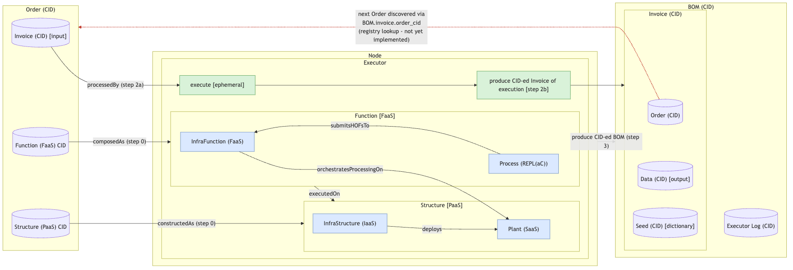

# CAT Node's Control-Feedback Loop:

## Control-Feedback Loop Specification:

1. The "Architectural Quantum" is a Minimal Federated Operating Model that adheres to Domain-Driven Design principles
2. The "Node" consumes an "Order" containing an input "Invoice" of input data to be processed as well as the Architectural Quantum's functional domain components that process Invoiced data; The content of the Order CID to be processed by the Node's "Factory" consists of the following: (*)
   - **A.** the CID-ed input Invoice as is within `data/input/data/*`
   - **B.** the CID-ed Architectural Quantum's functional domain components:
     - **a.** "Function [FaaS]" consists of "Process [REPL(aC)]" and "InfraFunction [FaaS]" as its dependency
       - Function [FaaS] (as Code) is CID-ed for which the contents consist of CIDs for Process [REPL(aC)] and InfraFunction [FaaS]
       - Process [REPL(aC)] is a *Read-Eval-Print Loop as Code* (such as a Marimo notebook UI) that composes and submits callables: transport **port** callables (ingress, integration_cache, egress — each receives Function-owned `TransportPort`) plus a Transfer Higher-Order Function / tHOF (`integrated_subproc` — Plant-agnostic `ComputePort.run_transfer`; this demo’s Structure wires `RayComputePort` in the job entrypoint). Process itself is the composer, not a tHOF; peering mutate is Structure TF (`ipfs_transport_peering` / `TransportContext.ensure_peered`), not Process heal. Compose with **named imports** of the Process public surface only (never `import *`).
     - **b.** "Structure [PaaS]" is Function's infrastructure dependency and consists of "Plant [SaaS]" and Plant's "InfraStructure [IaaS]" infrastructure dependency
       - Structure [PaaS] (as Code) is CID-ed for which the contents consist of Plant [SaaS] and InfraStructure [IaaS] CIDs
3. The Node's "Factory" processes an Order to produce "Executor" of an Architectural Quantum by composing Function [FaaS], constructing Structure [PaaS], then instantiating Executors with Function [FaaS] & Structure [PaaS] as its dependencies / parameters
4. The Executor is a composition of Architectural Quantum execution that executes and Invoices the ephemeral execution of the Architectural Quantum.
   - **A.** the Executor executes the aforemention composition as a Function [FaaS] executing on Structure [PaaS]: transport port callables run locally with a narrowed `TransportPort`; InfraFunction [FaaS] (the actuator) dispatches the tHOF onto Plant via `PlantPort` (`Plant.plant_port()` → `RayPlantPort` for this demo) with scratch via `ObjectStore` / `JobHandle`; in-job entrypoint wires `ComputePort`
   - **B.** the Executor Invoices the ephemeral execution of the Architectural Quantum by producing a CID-ed Invoice containing the original CID-ed Order, the CID-ed output Data (`data_cid`), interim stage CIDs (`ingress_data_cid`, `integration_data_cid`), and a (non-deterministic processing) Seed (dictionary for Process [REPL(aC)]) — **Seed is specified but not yet populated** (`seed_cid` remains null; tracked by [#187](https://github.com/DynamicalSystemsGroup/cats/issues/187)); stage CIDs on the Invoice are the interim feedback surface
5. The Node produces a CID-ed BOM containing an CID-ed Invoice and CID-ed Executor execution "logs" (*)

### Notes (*):

  - **2.** The Order is intended to be consumed from within a "BOM" hosted on a registry; i.e. - discovered via that BOM's "invoice.order_cid" - rather than supplied out-of-band; **this registry is not yet implemented**, such that the Node's `/cat/node/init` endpoint accepts the target `order_cid` directly as input today, standing in for the not-yet-built "look up a BOM on the registry, then consume its Order" step
  - **4B.** Until Seed exists, compose on the Order CID graph and feedback via Invoice/BOM stage CIDs; when Seed lands, it holds the Process replay dictionary and Invoice keeps Order + output data + `seed_cid`
  - **5.** CIDs of BOMs are intended to be published to the registry (0c) for future Orders to be consumed from
